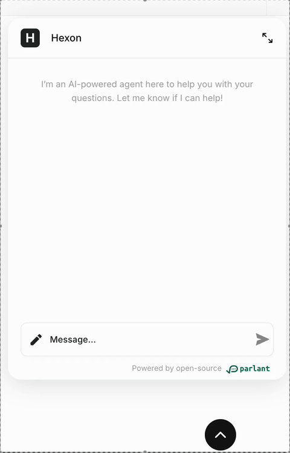

# parlant-chat-react

<!-- 

 -->

A flexible and customizable React chat component for integrating Parlant agents seamlessly into your website.




## Installation

```bash
npm install parlant-chat-react
# or
yarn add parlant-chat-react
```

## Quick Start

Here's how to quickly add the chat component to your React application:

```jsx
import React from 'react';
import ParlantChatbox from 'parlant-chat-react';

function App() {
  return (
    <div>
      <h1>My Application</h1>      
      <ParlantChatbox 
        agentId="AGENT_ID"
        server="PARLANT_SERVER_URL" 
      />
    </div>
  );
}

export default App;
```

## Usage Examples

### Basic Embedded Chat

Add a chat interface directly in your page layout:

```jsx
<ParlantChatbox 
  agentId="AGENT_ID"
  server="PARLANT_SERVER_URL" 
/>
```

### Popup Chat

Display the chat as a popup that can be toggled with a button:

```jsx
<ParlantChatbox 
  float 
  agentId="AGENT_ID"
  server="PARLANT_SERVER_URL" 
/>
```

### Customized Popup Button

Use a custom button component:

```jsx
import { Send } from 'lucide-react';

<ParlantChatbox 
  float 
  agentId="AGENT_ID"
  server="PARLANT_SERVER_URL"
  popupButton={<Send color="white" size={24} />} 
/>
```

### Advanced Styling

Apply custom class names to various parts of the chat:

```jsx
<ParlantChatbox 
  agentId="AGENT_ID"
  server="PARLANT_SERVER_URL"
  classNames={{
    chatboxWrapper: "my-chatbox-wrapper-class",
    chatbox: "my-chatbox-class",
    messagesArea: "my-messages-class",
    agentMessage: "agent-bubble",
    customerMessage: "customer-bubble",
    textarea: "my-input-class",
    popupButton: "my-button-class",
    popupButtonIcon: "my-icon-class",
    chatDescription: "my-description-class",
    bottomLine: "my-footer-class"
  }}
/>
```

### Custom Component Replacement

Replace default UI components with your own:

```jsx
<ParlantChatbox 
  agentId="AGENT_ID"
  server="PARLANT_SERVER_URL"
  components={{
    popupButton: ({ toggleChatOpen }) => (
      <button onClick={toggleChatOpen}>Chat with us</button>
    ),
    agentMessage: ({ message }) => (
      <div>
        <p>{message.data.message}</p>
        <span>Agent</span>
      </div>
    ),
    customerMessage: ({ message }) => (
      <div>
        <p>{message.data.message}</p>
        <span>You</span>
      </div>
    ),
    header: ({ changeIsExpanded }) => (
      <div>
        <h2>Custom Header</h2>
        <button onClick={changeIsExpanded}>Toggle Expanded</button>
      </div>
    )
  }}
/>
```

## Props

| Prop                   | Type           | Required | Default | Description                                                                 |
|------------------------|----------------|----------|---------|-----------------------------------------------------------------------------|
| `server`               | string         | Yes      | -       | API endpoint for chat communication                                         |
| `sessionId`            | string         | No       | -       | Unique identifier for an existing chat session                              |
| `titleFn`              | function       | No       | -       | Function that returns a string to generate dynamic chat session titles       |
| `agentId`